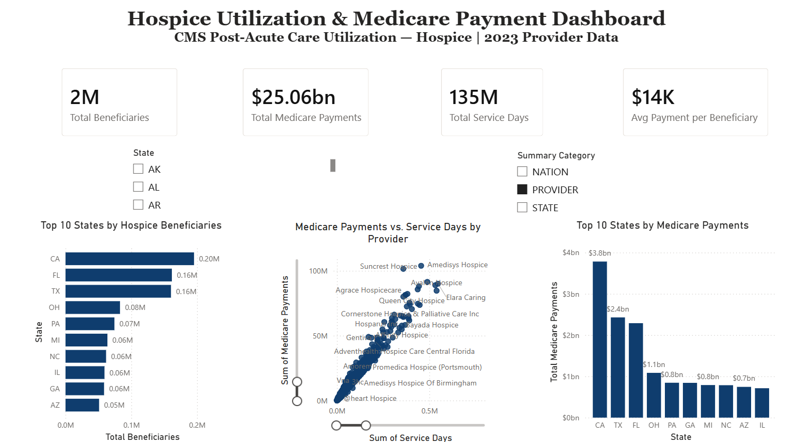

# Hospice Utilization & Payment Dashboard

## Overview

Power BI analysis of Medicare hospice utilization, payments, provider characteristics, and geographical patterns.

## Business Question

How does hospice utilization and payment vary across geography and provider characteristics?

## Data

- **Source:** Centers for Medicare & Medicaid Services (CMS)
- **Dataset:** Medicare Post-Acute Care Utilization — Hospice by Geography/Provider
- **Reporting year:** 2023
- **Level:** Hospice provider
- **Data type:** Public provider-level healthcare data
- **Source:** [Medicare Post-Acute Care Utilization - Hospice by Geography and Provider](https://data.cms.gov/provider-summary-by-type-of-service/medicare-post-acute-care-hospice/medicare-post-acute-care-utilization-hospice-by-geography-and-provider)
- Raw data is not included in this repository.

Because the dataset contains multiple reporting levels (NATION, STATE, and PROVIDER), the dashboard analysis was filtered to PROVIDER records to avoid mixing reporting levels.

## Tools

- Power BI
- Power Query
- DAX
- GitHub

## Analysis

- Provider-level reported beneficiary volume
- Medicare payments
- Service days
- Average Medicare payment per reported beneficiary
- Top 10 states by reported beneficiaries
- Top 10 states by Medicare payments
- Provider-level relationship between Medicare payments and service days
- Interactive state and reporting-level filters

## Dashboard

## Key Findings
- Provider-level records represented approximately 2 million reported beneficiaries, $25.06 billion in Medicare payments, and 135 million service days in the filtered dataset.
- California ranked highest among states shown for both reported beneficiary volume (approximately 200K) and Medicare payments ($3.8B).
- Texas and Florida followed California in Medicare payments, with approximately $2.4B and $2.3B, respectively.
- The provider-level scatter plot shows a strong positive relationship between service days and Medicare payments, with several high-volume providers standing out from the broader provider population.
- The top 10 states by Medicare payments accounted for a substantial share of reported Medicare spending in the dataset.

## Data Preparation

Data was prepared in Power Query before analysis. Steps included:

- Reviewed and standardized data types
- Renamed CMS field names for readability
- Prepared provider, beneficiary, payment, and utilization fields for analysis
- Preserved missing/suppressed CMS values rather than treating them as zero

## Limitations

This analysis uses publicly available provider-level CMS data and describes reported utilization and payment patterns. It does not establish causation or evaluate individual patient outcomes.

CMS data may contain suppressed or missing values for privacy and reporting purposes.

## Project Structure

- `Hospice_Utilization_Dashboard.pbix` — Power BI dashboard
- `screenshots/hospice_dashboard.png` — dashboard screenshot
- `README.md` - project documentation
